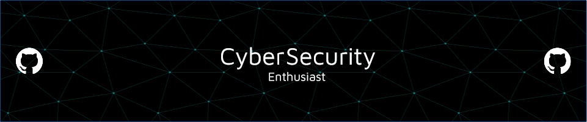

# 💫 About Me:
Hi, My name is sourabh Das PM  I'm currently working as Cyber Security Researcher. 

## 🌐 Socials:
  

# 💻 Tech Stack:
                          
# 📊 GitHub Stats:
 
 

### ✍️ Random Dev Quote

---

<!-- Proudly created with GPRM ( https://gprm.itsvg.in ) -->
